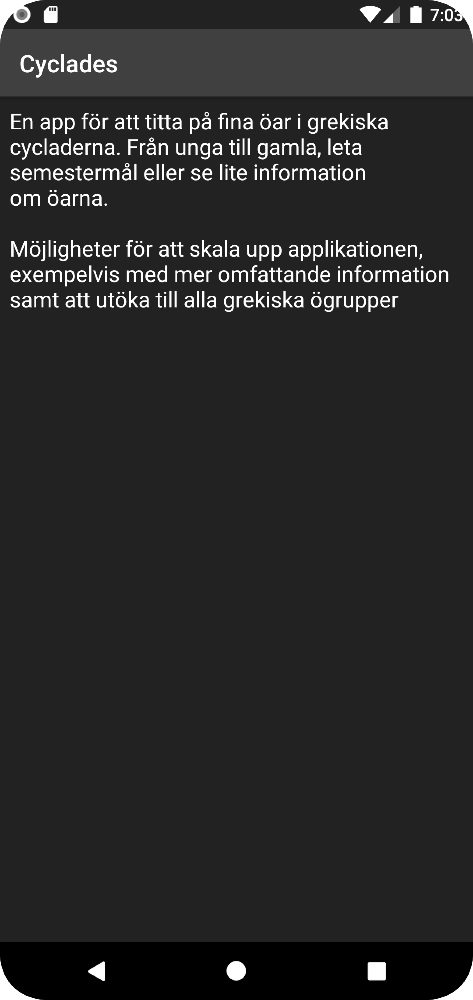

# Rapport

Projekt arbetet handlade om att konstruera en app som tar emot json data för att konvertera till en
typ av lista. Arbetet påbörjades med att skapa de nödvändiga klasser som krävdes vilket innefattar
objekten från json, JsonTask, SecondActivity samt en RecyclerAdapter.

Objekten blev öar från grekland, där namn, bild, plats samt population ska kunna visas.
Mestadels av koden är snarlik den tidigare recyclerviewen, men för att kunna importera bilder
behövdes nya tekniker användas. Jag använde biblioteket picasso för detta.

build.gradle behöver då denna rad:
```gradle
implementation 'com.squareup.picasso:picasso:2.71828'
```

Importeringen av bilderna blir då smidiga och använder denna rad:
```java
Picasso.get().load(image).into(holder.islandImage);
```

Second activity fick en egen knapp i toolbaren med hjälp av en inflater samt en intent i main
activity.
```java
public boolean onCreateOptionsMenu(Menu menu) {
        getMenuInflater().inflate(R.menu.main_menu, menu);
        return true;
    }

    @Override
    public boolean onOptionsItemSelected(MenuItem item) {
        int id = item.getItemId();

        if (id == R.id.aboutButton) {
            Intent intent = new Intent(MainActivity.this, SecondActivity.class);
            startActivity(intent);
            return true;
        }
        return super.onOptionsItemSelected(item);
    }
```

Sedan har vi second activity som har koden:
```java
protected void onCreate(Bundle savedInstanceState) {
        super.onCreate(savedInstanceState);
        setContentView(R.layout.activity_second);
        Bundle extras = getIntent().getExtras();
        secondTextView = findViewById(R.id.secondTextView);
        secondTextView.setText(R.string.about_text);

    }
```

Större delen av arbetet har gått åt designen då allt annat gick smidigt. Så rundade kanterna på
korten inuti recyclerviewen med hjälp ut av en drawable fil.
```xml
<?xml version="1.0" encoding="UTF-8"?>
<shape xmlns:android="http://schemas.android.com/apk/res/android">
    <solid android:color="#404040"/>
    <stroke android:width="8dp" android:color="#404040" />
    <corners android:radius="30dp"/>
    <padding android:left="0dp" android:top="0dp" android:right="0dp" android:bottom="0dp" />
</shape>
```

Som båda textViewsen i list_items använder. Har även försökt designa appen med mörkare färger
då det är något jag själv föredrar på mobilapplikationer.
Jag hade ingen tanke på designen från starten av arbetet utan den byggdes utefter utvecklandet,
därav har jag ingen skiss bland följande bilder.

# Första skärmen.


# About skärmen.
